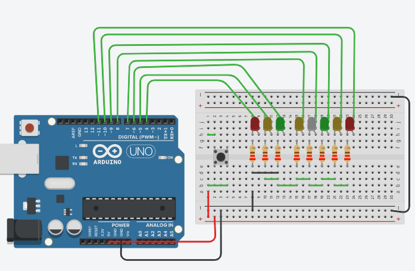

# LUCES 3

> ## ARDUINO PROJECT BASIC

In this folder review the next objetives

## OBJECTIVES

 * Understand the functions loops
 * Define the block structures.

## CIRCUIT

## OUTPUT

* Use the PIN 4 to PIN 11 as output.
* Use resistor of 220 ohms of 1/4 W in each LED(Light Emisor Diode)
* The circuit the circuit is powered by 5 volts. The Red wire is the positive and Black wire is Ground
* 5V for HIGH y 0V for LOW

### FOR AND WHILE

In this code we turn on and off LEDs sequentially, from right to left and left to right