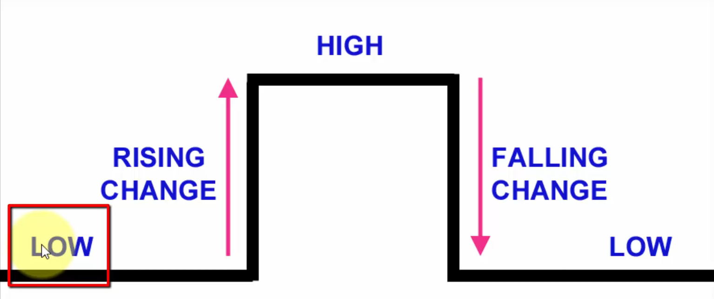

# LUCES 3

> ## ARDUINO PROJECT BASIC

In this folder review the next objetives

## OBJECTIVES

 * How use the interruptions. 
 * How use the intput and Output in Arduino


## CIRCUIT

<p align="center"></p>

## OUTPUT

* Use the PIN 22 to PIN 29 as output. ( You can use other Pins in digital OUTPUT)
* Use resistor of 220 ohms of 1/4 W in each LED(Light Emisor Diode)
* The circuit the circuit is powered by 5 volts. The Red wire is the positive and Black wire is Ground
* 5V for HIGH y 0V for LOW
* Two PINs of INPUT, Pin 2 and Pin 3( The next image show the PINs in differents Arduino)

<p align="center"></p>

### RISING

```
attachInterrupt(digitalPinToInterrupt(2), velocidadMenos, RISING);
attachInterrupt(digitalPinToInterrupt(3), velocidadMas, RISING);
```

This function interrupt the code, the first parameter is the number of the pin(See image), the second parameter is the funcion to realize when is interrupt the code, and third parameter is the Rising, wait in status LOW and whan press the Button the Rising is status High(punfiguration Pull Down) and interrupt the code.

<p align="center"></p>

